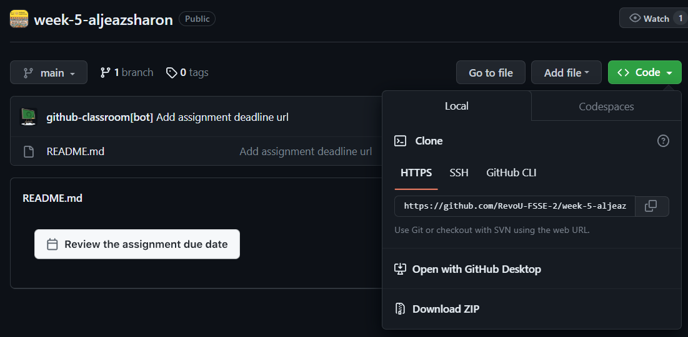

<h1 align="center"> Week 05 Assignment </h1>

## This week's assignment is about making a company profile and deploying it with Netlify, Cloudflare (setting up DNS), and hosting the website (with NiagaHoster).

## Website Structure
1. HTML
    - Home Page contains all the information about the company.
    - Museum Location Page contains a list of museum locations that can be found in Indonesia.
    - Events Page contains a list of events that are happening now and will happen in the future.
2. CSS
    - style page = styling the HTML page for the website.
    - responsive page = responsive media for the website.

## Setting Up the Website
#### Github
<ol>
li>Clone Repository using git clone https://github.com/RevoU-FSSE-2/week-5-aljeazsharon.git

</li>
</ol>
